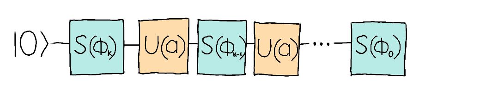

## Challenge statement

As you explore deep into the Femto Forest, you notice that the ground is a bit moist and thick. You see a sign with large bold letters telling you to *"Keep out of this swamp"*. Resisting the urge to watch Shrek for the 100th time on your smartphone, you recall that you read about this place in a tourist guide. The Quantum Swamp of Peril is known to absorb any substance and turn it into a toxic version of itself. Leat you become a venomous zombie (and not the superhero kind), make sure to do as the sign says!

While the transformation that the swamp applies on individual quantum states is still unknown, a simplified model suggests that might be a Quantum Singular Value Transform. This seems to be an approximation, and some scholars think that such monstrosities can only be created by non-linear quantum effects, hence the interest in studying this swamp!

The Quantum Singular Value Transform (QSVT) is a quantum algorithm that has become really popular in the research community due to its many applications. In this challenge, we will study a precursor to QSVT, an algorithm known as **Quantum Signal Processing** (QSP). This algorithm works on one qubit and is given by the following circuit


<p align="center">

</p>


Here, $S(\phi)$ denotes to the phase operator 

$$ S(\phi) = \begin{pmatrix} e^{i\phi} & 0 \\ 0 & e^{-i\phi} \end{pmatrix}, $$

also known as the quantum signal processing matrix. The operator $U(a)$ is given by the unitary matrix

$$

U(a) = \begin{pmatrix} a & \sqrt{1-a^2} \\ \sqrt{1-a^2} & -a \end{pmatrix},
$$

where $a \in [-1,1].$ 

If we write down the matrix that represents the whole circuit, we can show that it takes the form

$$
S(\phi_0)\prod_{k=1}^{d}U(a)S(\phi_k) = \begin{pmatrix} P(a) & * \\ * & * \end{pmatrix},
$$

where $P(a)$ is a complex polynomial of at most degree $d$ and parity $d \ \text{mod}\ 2$. This polynomial depends only on the phase angles $\phi_k$. 

In this challenge, you are given four phase angles $\phi_k$ $(k=1,\ldots, 4)$ which, when fed to the QSP routine, encode a polynomial of the form

$$ 
P(a) = \alpha a^{3} + \beta a, \quad \alpha,\ \beta \in \mathbb{C}.
$$

Your objective in this challenge is to find the complex coefficients $\alpha$ and $\beta$ of this polynomial given the phase angles. 

## Challenge Code

In the challenge template, you must complete the following function.

- `coefficients:` Given an array $[\phi_0, \phi_1, \phi_2, \phi_3]$ (`np.array(float)`) containing the phase angles, this function yields an array $[\alpha, \beta]$ (`np.array(complex)`) with the coefficients of the polynomial $P$ generated by the QSP circuit. 

You are also given some space to write some helper functions. It might be useful, for example, to write a routine that returns the matrix associated with the phase angles and a number $a \in [-1,1].$ Remember that `qml.qsvt` is available for you to use. 

### Input

As an input to this challenge, you are given an array $[\phi_0, \phi_1, \phi_2, \phi_3]$ (`np.array(float)`) containing the phase angles, in the order shown in the circuit above. 

### Output

The expected outputs as listed in the test cases below are encoded in a list of the form $[[\text{Re}(\alpha), \text{Im}(\alpha)], [\text{Re}(\beta), \text{Im}(\beta)]]$ (`list`). The output in this format will be built from the `np.array(complex)` output of your `coefficients` function.

### Test cases

The following **public test cases** are available for you to check your work. There are also some **hidden test cases** which we will use to check that your solution works in full generality.

```python
test_input: [0.5,0.8,1.0,1.0]
expected_ouput: [[-0.1707976, -2.4084889], [-0.8166822, 2.2507432]]

test_input: [-0.20409113, -0.91173829, 0.91173829, 0.20409113]
expected_output: [[2.5,0],[-1.5,0]]
```

If your solution matches the correct one up to a relative tolerance of $1\times 10^{-4}$, the output will be `"Success!"`. Otherwise, you will receive an `"Incorrect"` prompt.

Good luck!