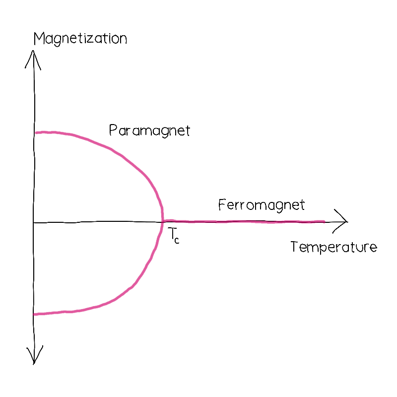

## Challenge statement

Ah... you've helped the cave people get better at the ancient game of ice hockey. You exit the cave and spot a chalet with a café in the distance. You hastily walk over there, yearning for a soothing shot of espresso...

Sadly for you, the café's espresso machine isn't working!

You exclaim: "ARGH! Are you kidding me?" 

"I'm so sorry, but our espresso machine isn't working right now," says the barista. "It requires a specific magnetic field value to run. The machine's magnet can be modelled by the transverse-field Ising model, and we need it to be at its critical point for the machine to work," the barista explains.

Coffee might seem like an everything-is-figured-out kind of beverage because we've been brewing it for decades in a bunch of different ways. I mean, really, how many different ways could you possibly pour water over ground-up coffee beans? Those ancient cave people playing ice hockey were actually pretty smart cookies. The cold, cold hockey games forced them to create extra hot beverages to warm them back up. They figured out that by introducing critical condensed matter physics into the brewing process for espresso, they could obtain hotter shots of espresso without sacrificing any flavour. In fact, this method of brewing made the shots more caffeinated — more energy for more hockey! A win-win ☕️

Begrudgingly, you accept the challenge of fixing the machine by finding the critical point of this "transverse-field Ising" model, but you need some  background on phase transitions first!

Quantum circuits can be utilized in a multitude of contexts, including condensed matter physics (CMP). A huge part of CMP is finding different phases of matter by identifying phase transitions. "Why should I, a scholar of quantum computing, care about phase transitions?" you might be asking. Great question! There's actually a ton of research at the intersection of quantum computing and CMP, like quantum error correcting codes, for example (no big deal). So, it's important to know a little bit about phase transitions.

"How do we identify phase transitions?" you are most certainly asking — with *order parameters*, of course!

An order parameter is something that quantifies the degree of order/disorder in a system of particles. The "borderline" or *critical point* that separates the disordered and ordered phases is indicative of spontaneous symmetry-breaking: a smoking gun for a phase transition. The finite-temperature phase transition in the Ising model is probably the most commonly taught phase transition in physics, where the phase transition is indicated by a sudden change in magnetization as the temperature changes. 

<p align="center">

</p>

The two branches indicate the symmetry-breaking behaviour when the critical point is reached, where the choices indicate a preference between spins being up or down.

Anyway — that's just a little tidbit about phase transitions and order parameters. We're going to look at how we can *roughly* estimate critical points in PennyLane with an example: the infamous transverse-field Ising model (TFIM)!

The TFIM Hamiltonian for $N$ spins is the following:

$$
H = -\sum_{i < j} Z_i Z_j - h \sum_{i=1}^N X_i.
$$

This Hamiltonian describes nearest-neighbour interacting spins — the $\sum_{i < j} Z_i Z_j$ term (we're going to just look at 1D chains here) — in the presence of a transverse field with a strength $h > 0$. There exists an ordered-disordered phase transition, where the order parameter is the magnetization:

$$
\langle M \rangle = \frac{1}{N} \langle \psi \vert \sum_{i=1}^N Z_i \vert \psi \rangle,
$$

for a particular value of $h = h_c$. There's a little bit of nuance here that we need to be aware of so that we get the right answer, though. The TFIM has a $\mathbb{Z}_2$ symmetry; it's symmetric under flipping every qubit. So, when you try to calculate the magnetization, you'll get zero every time! To be able to detect the phase transition, we need to calculate the absolute value of the magnetization:

$$
\langle |M| \rangle = \frac{1}{N} \sum_{\sigma = 0}^{2^N - 1} \vert \langle \sigma \vert \psi \rangle \vert^2 \left|\sum_{i=1}^N \langle \sigma \vert Z_i \vert \sigma \rangle\right|,
$$

Since spin-up or spin-down doesn't matter for this model, calculating its absolute value is essentially like "choosing" spin-up or spin-down. 

"How might we calculate this in PennyLane? It doesn't look like a normal expectation value..." you say? Well, good thing PennyLane lets you create *custom* measurements! You'll have to do so to complete this challenge 😎. More later...

The phases of matter at play here are the *ferromagnetic* ($h = 0$) and *paramagnetic* ($h \rightarrow \infty$) phases:

1. **Ferromagnetic** (ordered phase): when $h = 0$, the ground state of the TFIM Hamiltonian is all spins being aligned ($\vert \uparrow \rangle^{\otimes N}$ or $\vert \downarrow \rangle^{\otimes N}$) and $\langle |M| \rangle = 1$.
2. **Paramagnetic** (disordered): when $h \rightarrow \infty$, the transverse field dominates and the ground state is all spins being in the $\vert + \rangle$ state and $\langle |M| \rangle = 0$.
   
Your job will be to make a finite-size estimate of the critical point $h_c$ that separates the ferromagnetic and paramagnetic phases. To do this, you must first find the ground state of the TFIM Hamiltonian for a given number of qubits and several different values of $h$, calculate $\langle |M| \rangle$ over those values of $h$ and estimate $h_c$. Once you've completed this problem, consider yourself a condensed matter physicist! ... sort of.

## Challenge code

In the code below you must complete the following functions and classes:

1. `AbsMagnetization`: a custom measurement that inherits from the `StateMeasurement` class (see here: https://docs.pennylane.ai/en/stable/code/api/pennylane.measurements.StateMeasurement.html). In it, you must define the `process_state` method, which will return $\langle | M | \rangle$ (`float`).
2. `tfim_ground_state`: a function creates the TFIM Hamiltonian given a number of qubits `num_qubits` (`int`) and a transverse field value `h` (`float`). It must return a `np.tensor` that represents its ground state. You *could* use other libraries than PennyLane, but, y'know, use PennyLane — it's actually super nice here!
3. `magnetization`: a QNode that calculates $\langle |M| \rangle$. It should prepare the ground state from `tfim_ground_state` in a quantum circuit and return `AbsMagnetization(wires=list(range(num_qubits)))`.

### Input

As an input to this problem, you are given the number of qubits `num_qubits` (`int`): the size of the 1D chain of spins. 

### Output

After having calculated an array, `np.array(float)`, of absolute-magnetization values corresponding to different values of the transverse field, $h$, your code must output an estimate of the critical point, $h_c$.

### Test cases

The following **public test cases** are available to you. Note that there are additional **hidden test cases** that we use to verify that your code is valid in full generality.

```python
test_input: [5]
sample_output:, [0.633], 
test_input: [2]
sample_output:, [0.353],
```

If your solution matches the correct one within the `5e-3` relative error tolerance, the output will be `"Success!"`. Otherwise, you will receive an `"Incorrect"` prompt.

Good luck!