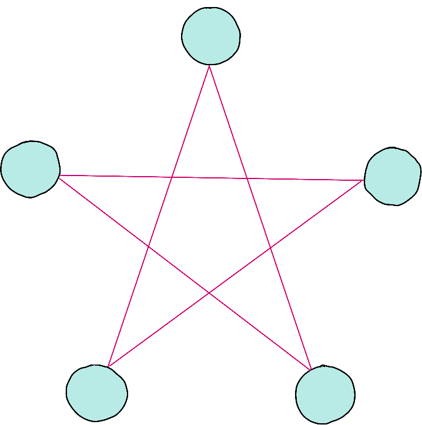

Note from the author: Quantum foundations has to be one of my favourite topics in quantum theory. One of its main objectives is figuring out what makes quantum phenomena actually different from what we see in real life. I think contextuality might be one of the purest quantum phenomena, and I believe it is behind quantum speedups. Not everyone agrees on this though. This is a super interesting topic and I hope you'll find some motivation to look into it more!

## Challenge statement

In the Dipole Desert, meteorological phenomena such as sandstorms are governed by strange physical laws. Meteorologists in Qutopia are experts in quantum theory and have used it to predict the sandstorms' frequency, intensities, and even the dune formations that they leave behind.

One of the main hints that quantum theory was the best way to model the behaviour of the sandstorms is the formation known as the Contextual Dunes. These are a set of five dunes that exist in a superposition of crescentic $\vert 0 \rangle$, linear $\vert 1 \rangle$, and parabolic $\vert 2 \rangle$ dune shapes. 

But just because the dunes exist in a superposition, it doesn't mean that their behaviour is quantum. After all, there are classical theories that can model superposition. 

You stand in awe in front of these dunes. For the first time, you witness superposition in real life! But you're witnessing so much more than that. 

 Contextuality is one of the features of quantum theory that sets it apart from classical models. Kochen-Specker contextuality means that the predictions of quantum mechanics cannot be reproduced by a hidden variables theory that
 
 1. is deterministic, and
 2. is measurement non-contextual. That is, when we measure a specific variable, the results don't depend on *how* we make that measurement. 

Recently, the concept of contextuality has been used to identify machine learning problems that might be more efficiently solvable using quantum computers. More generally, it is conjectured that contextuality is at the root of exponential quantum speedups.
 
A simple proof of contextuality in quantum theory is due to Klyachko. It involves placing 5 qutrits $\vert \phi_0\rangle,\ldots,\vert \phi_4\rangle$ on a star shape, such that the qutrits that are joined by a line must be orthogonal to each other. See the figure below for reference. 

<p align="center">

</p>

Klyachko showed that if for some state $\vert \psi \rangle$ we can find a set of qutrits like the above that satisfy

$$
\sum_{i=0}^{4}|\langle \psi \vert \phi_i\rangle |^2 > 2,
$$

then any hidden variable theory describing qutrits must be Kochen-Specker contextual. 

The scientists in the Dipole Dessert had to study the dunes after several sandstorms until they found them to be in states that satisfied the Kyachko inequality. Their behaviour had to be quantum!

In this challenge, you will use PennyLane's qutrit capabilities to find a set of qutrits that satisfies Klyachko's inequality. You will do this by creating a single-qutrit circuit that prepares qutrit states of the form

$$ 
\vert \phi_i\rangle = \sin(\chi)\cos(\eta_i)|0\rangle + \sin(\chi)\sin(\eta_i)|1\rangle + \cos(\chi)|2\rangle.
$$

Then, with the aid of this circuit, you will write a script that computes the sum above for some given state $\vert \psi \rangle = \vert 2 \rangle$ and some given value of $\chi$ and $\eta_j$.  


## Challenge Code

In the challenge template, you must complete the `prepare_qutrit` helper function which, given the angles $\chi$ (`chi` (`float`)) and $\eta$ (`eta` (`float`)), prepares the qutrit state

$$ 
\vert \phi(\chi,\eta)\rangle = \sin(\chi)\cos(\eta)|0\rangle + \sin(\chi)\sin(\eta)|1\rangle + \cos(\chi)|2\rangle
$$

and returns the measurement probabilities in the computational basis.

Then, you must complete the main function `evaluate_sum` that, given a list (`list(float)`) of five angles $[\eta_0,\ldots,\eta_4]$ and the angle $\chi$ (`chi` (`float`)), computes the sum

$$
S=\sum_{j=0}^{4}|\langle \psi \vert \phi_j\rangle |^2, 
$$

where $\vert\psi\rangle = |2\rangle$ and $|\phi_j\rangle = \vert \phi(\chi,\eta_j)\rangle.$ 

---

**Note:** The first public test case uses $\chi = \cos^{-1}(1/\sqrt[4]{5})$ and $\eta_j = 4\pi j / 5,$ which gives $S = \sqrt{5}>2.$ In this case, the $|\phi_j\rangle$ are orthogonal when connected by an edge as well (verify this yourself if you are so inclined), which proves Kochen-Specker contextuality!

---

### Input

As an input to this challenge, you are given an angle `chi` (`float`)and a list `eta_list` (`list`(`float`)) corresponding to the angle $\chi$ and the list $[\eta_0,\ldots,\eta_4]$ as defined above.

### Output

The expected output is a `float` which corresponds to the sum 

$$
S=\sum_{j=0}^{4}|\langle \psi \vert \phi_j\rangle |^2. 
$$

### Test cases

The following **public test cases** are available for you to check your work. There are also some **hidden test cases** which we will use to check that your solution works in full generality.

```python
test_input: 0.838283, [0.6283189, 1.884956, 3.141593, 4.398230, 5.654867]
expected_ouput: 2.236069

test_input: 0.4, [1.047198, 2.094395, 3.141593, 4.18879, 5.235988]
expected_output: 4.241767
```

If your solution matches the correct one up to an absolute tolerance of $1\times 10^{-4}$, the output will be `"Success!"`. Otherwise, you will receive an `"Incorrect"` prompt.

Good luck!