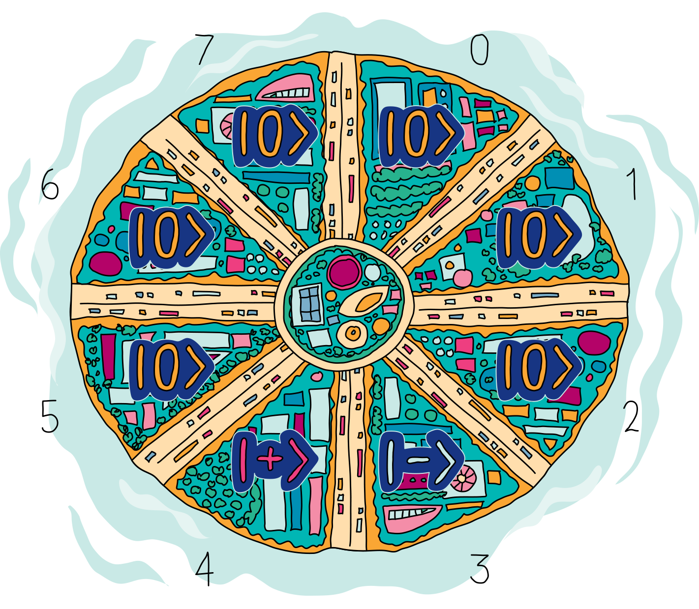
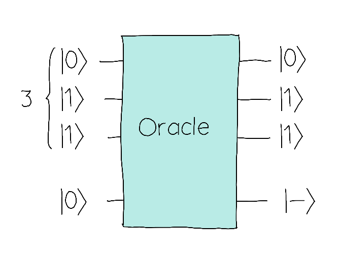
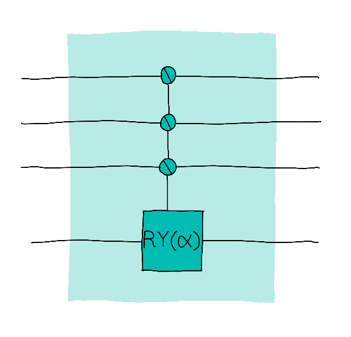

Note from the editor: I swear this was not inspired by Final Fantasy 7's Midgar and it's just a coincidence that the main author of this challenge wrote it this way. Are you excited about the release of Final Fantasy 7 Rebirth on February 29th? I am! And if you don't know what I'm talking about, you're missing out on a great game! It'll be such a great way to chill after QHack is over.

## Challenge statement

Congratulations on reaching Qutropolis, the quantum city that only the greatest experts in the field are able to reach. Here you can see a map of this great city:

Getting here is such an impressive feat that every time a new visitor arrives, they set off some fireworks to celebrate. 
The creation of fireworks is therefore very important in this city and they have a district dedicated exclusively to it.

However, another important district is the one where the fire station is located, which will be in charge of extinguishing any fire that occurs in the factory. 

Fortunately, the factory and the fire station are relatively close so we can say that the layout of the city is safe. The city would be in danger if the locations of these places were on opposite sides (eg. districts 1 and 5).

Your objective will be, given a new configuration of a city, to determine whether it is safe or not. 

To do this, we will represent the location where the factory is located with $|+\rangle$ and the location of the fire station with $|−\rangle$. The rest of the locations will be assigned the state $|0\rangle$. For example, on the map above, the factory is located in district 4 and the fire station is in district 3. 

You have an oracle in which you can ask what kind of buildings a district has. 

In this example, we are asking for the district number 3, `011` in binary.  In this case, the oracle returned $|−\rangle$, so in this district, we have the fire station.

It is probably useful for you to know how the oracle is built. Basically, it can be seen as a series of controlled-$R_y$ gates (`qml.CRY`). If the index of the district does not have a special building, there will be no rotation ($\alpha = 0).$ If we have special building $|+\rangle$ or $|-\rangle$ the oracle rotates by $\frac{\pi}{2}$ or $\frac{-\pi}{2}$, respectively.

Given this oracle, you must determine whether the districts in the city are safely distributed.

To do this, you can use the oracle as many times as you want in a $5$-qubit circuit. Making use of a single shot, you will have to determine whether the city is safe or not. You will have to store that information in the last wire, where $|1\rangle$ means it's safe and $|0\rangle$ means it isn't.

## Challenge code

Complete the `is_safe_configuration` function so that the output behaves as described in the statement. In this circuit, you can query the oracle as many times as you need, but you must determine the city's safety in **a single shot.**

### Inputs, outputs, and testing

In this case there will be no inputs. The tests will generate 500 different oracles and check that the requested conditions are met in all of them.
