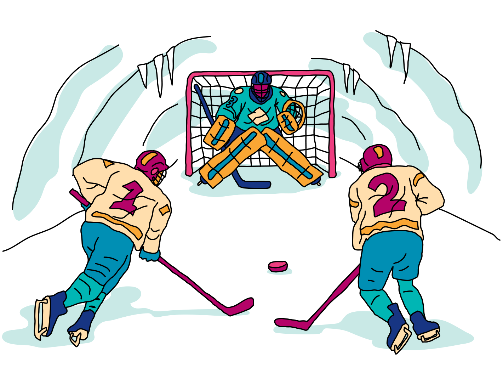

Note from the author: Can you believe it? A Canadian company that has held a hackathon every year for 5 years hasn't made a hockey-related challenge... until now! Don't worry though, you don't need to know the rules of hockey to do this challenge. But, we encourage you to learn the rules, watch a couple NHL or PWHL games, and see if you like it... just because.

## Challenge statement

You are powering through the snowy Tundra and stumble upon an ancient cave. Entering it, you see old drawings that look like "🏒" and "🥅". The ancient cave people of the Tundra played a game called "ice hockey." This ancient tradition of sportsmanship has been passed on through generations and is still played today by the present Tundra population. In fact, a game of ice hockey is being played in the cave right now! Let's see if we can inject some quantum into it...

Hockey is a game of speed, skill, and, most importantly for this challenge, *elusiveness*. When a player has the puck, will they pass? Shoot? Deke? A combination of any of those three? Whatever they decide to do, the goaltender (AKA goalie) is the last line of defence. 

Inarguably, one of the worst-case scenarios for a goalie is when their team has let them down and a 2-on-0 happens: two players from the opposing team just have the goalie in their way — the goalie is on an island! Throughout a game of hockey, a goalie usually saves 90% of the shots they face. Of course, the save percentage drops for a 2-on-0. 

<p align="center">

</p>

In this challenge, you're going to model a "quantum" 2-on-0. The opposing players are described by a quantum state $\vert \psi \rangle = \alpha \vert 01 \rangle + \beta \vert 10 \rangle + \kappa (\vert 00 \rangle + \vert 11 \rangle)$, where:

- $10$ represents player 1 shooting the puck,
- $01$ represents player 2 shooting the puck,
- and $00$ or $11$ means the goalie has no idea who will shoot 🤷‍♂️

The goalie is represented by a quantum state $\vert \phi \rangle = \gamma \vert 0 \rangle + \delta \vert 1 \rangle$, where $0$ represents the players scoring and $1$ represents the goalie making a save. **We will assume that $\delta > \gamma$ in this problem**: the goalie has a higher chance of saving a puck than letting in a goal. 

The goalie is allowed to "measure" player 1 and player 2 to see if they can figure out where the puck is:

- if the goalie measures $10$, they know that player 1 is shooting and their chances of letting in a goal decrease: $| \gamma^\prime |^2 = x |\gamma|^2$, where $x < 1$
- if the goalie measures $01$, they know that player 2 is shooting and their chances of letting in a goal decrease: $| \gamma^\prime |^2 = y |\gamma|^2$, where $y < 1$
- if the goalie measures $00$ or $11$, they *don't* know who is going to shoot the puck and their chances of letting in a goal increase by a factor of $z: | \delta^\prime |^2 = z |\delta|^2$, where $z < 1$.

Your job is to figure out the goalie's new save percentage after measuring player 1 and player 2.

## Challenge code

In the code below you must complete the following functions and classes:

1. `state_prep`: this is a quantum function that contains operations to prepare the initial states $\vert \psi \rangle$ and $\vert \phi \rangle$ given $\alpha$, $\beta$, $\kappa$, $\gamma$, and $\delta$. The players' wire labels are `"player1"` and  `"player2"` and the goalie's wire label is `"goalie"`, as shown in the device definition in the code below.
2. `save_percentage`: this is a QNode that implements the simulation mentioned in the challenge description above and calculates the new save percentage of the goalie — `qml.probs(wires=["goalie"])` — given $\alpha$, $\beta$, $\kappa$, $\gamma$, $\delta$, $x$, $y$, and $z$. In this QNode, you may ***only use 7 operations or less*** and you ***must use 3 mid-circuit measurement conditions*** (i.e., three instances of `qml.cond`).

There is space at the start of the code below for you to add any other functions that you want to define. We've also imported SciPy for you in case you want to use it.

### Input

As an input to this problem, you are given (in this order):

1. a list containing $\alpha$, $\beta$, and $\kappa$, 
2. a list containing $\gamma$, $\delta$, 
3. $x$, $y$, and $z$, separately. 

All values will be ***real numbers greater than zero***. $\alpha$, $\beta$, and $\kappa$ will be given to you so as to ensure that $\vert \psi \rangle$ is normalized. $\gamma$ and $\delta$ will also be given to you normalized.

### Output

Your code must output the goalie's save percentage distribution (the output of the `save_percentage` function).

### Test cases

The following **public test cases** are available to you. Note that there are additional **hidden test cases** that we use to verify that your code is valid in full generality.

```python
test_input: [[0.74199663, 0.17932039, 0.45677413], [0.28034464, 0.95989941], 0.999, 0.99, 0.98] # [[alpha, beta, kappa], [gamma, delta], x, y, z]
sample_output:, [0.08584767923415959, 0.9141523336414634], 
test_input: [[0.09737041, 0.40230525, 0.64368839], [0.00111111, 0.99999938], 0.9, 0.95, 0.92]
sample_output:, [0.2209658188643944, 0.7790341788983206],
```

If your calculated save percentage matches the correct one within the `1e-4` relative error tolerance, matches the output will be `"Success!"`. Otherwise, you will receive an `"Incorrect"` prompt.

Good luck!