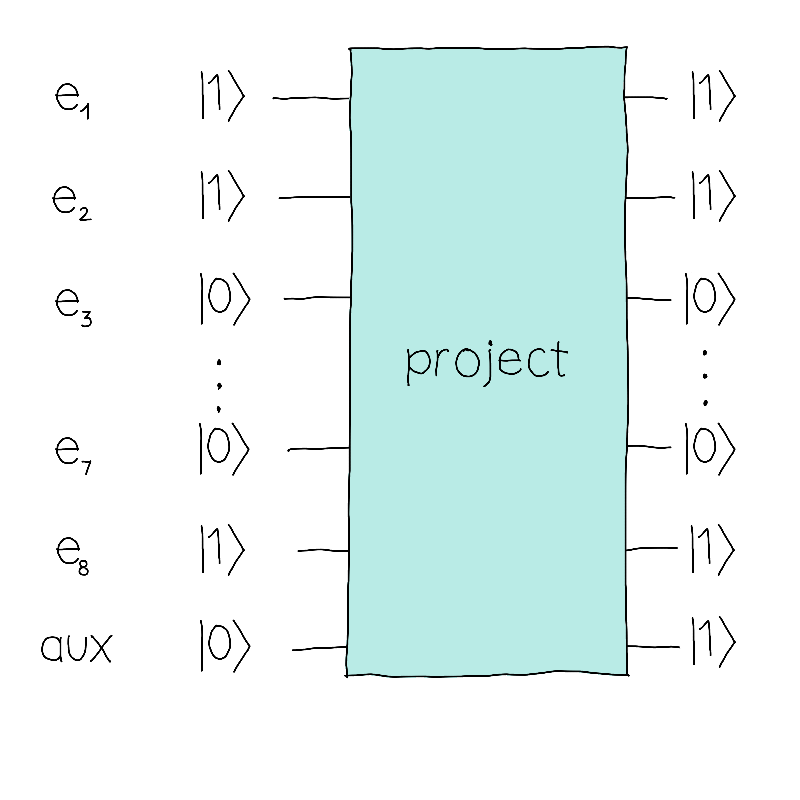

## Challenge statement

We are at the Femto Forest terminal, the only place in the region that will allow us to reach Qutropolis. The station is so important that they are always renovating and expanding the facilities. To carry out this work, the terminal has 8 workers ($e_1, e_2, e_8$). Normally, when a new project comes, the boss selects a subset of workers to perform the work. 

Unfortunately, among those workers, there are lazy employees (remember QHack 2023?) who will not work. But we don't know who those workers are. After all, co-workers don't usually snitch on each other. Given a project, it will be successfully completed if at least two employees are not lazy. For this reason, the boss usually assigns extra workers to avoid this problem. 

You're kind of in a rush to get to Qutropolis... all those sweet prizes and fame and fortune await! To expedite the re-opening of the terminal, you offer your quantum computing expertise so that the boss can make sure more projects are completed.

We have a 9-qubit "project" oracle (8 input qubits + 1 auxiliary qubit) that tells us if the project will get completed successfully given a particular team of employees assigned to the project,.

To do this, we will assign a qubit to each employee. That qubit will be in the state $\vert 1 \rangle$ if the employee is assigned to that particular project, and it'll be in the $\vert 0 \rangle$ state otherwise.

In the example above, since we obtained a `1` in the auxiliary register, it implies that between $e_1$, $e_2$ and $e_8$ there are at least 2 non-lazy workers.

A new project has come along and, unfortunately, we can only assign 2 workers to it! This is a problem, as we must choose 2 non-lazy workers to make sure the project gets completed successfully. 

Your goal will be to create a quantum circuit such that when measuring the first 8 qubits (the employees), the boss gets a list — $e_1, e_2, \dots, e_8$, where $e_i \in {0, 1}$ — of all zeros except for exactly 2 entries that will be $1$, indicating 2 non-lazy workers. 
To do this, you can use the oracle as many times as you want. The boss will be happy if the probability of getting ***exactly*** 2 non-lazy workers is at least 95%. Note that you can get an overlap of configurations, the important thing is that the sum of the probabilities of all valid configurations is at least 95%. 

The "project" oracle will apply an $X$ gate on the auxiliary qubit if the project is successfully completed (exactly 2 non-lazy employees are found).

Help the boss move the project forward, or it will be impossible to reach Qutropolis!

## Challenge code

In this challenge, you must complete the `circuit` function. You will be given access to the `oracle` that determines whether the project has been completed successfully or not.
To better understand the output, let's see an example. Suppose that only workers 1, 2 and 3 are non-lazy workers. 

- The output state $|11000000\rangle$ is a valid solution since it has exactly 2 non-lazy workers.
- The output state $|11010000\rangle$ is not a valid solution since it has more than 2 workers in the team.
- The output state $|11100000\rangle$ is not a valid solution since it has more than 2 workers in the team (even if all of them are non-lazy workers).
- The output state $\frac{|11000000\rangle + |1010000\rangle}{\sqrt{2}}$ is a valid solution because both basis states have exactly two non-lazy workers.
- The output state $\frac{|11000000\rangle + |1110000\rangle}{\sqrt{2}}$ is not a valid solution because the probability of getting a valid solution is < 95%.
- The output state $i|11000000\rangle$ is a valid solution since it has exactly 2 non-lazy workers.

### Input 

The input will be a list `list`(`int`) with the indexes of productive workers. From these, we will generate the oracle that will be the input of your circuit.

### Output and test cases

There are no outputs or test cases. We will check that the circuit behaves as expected.