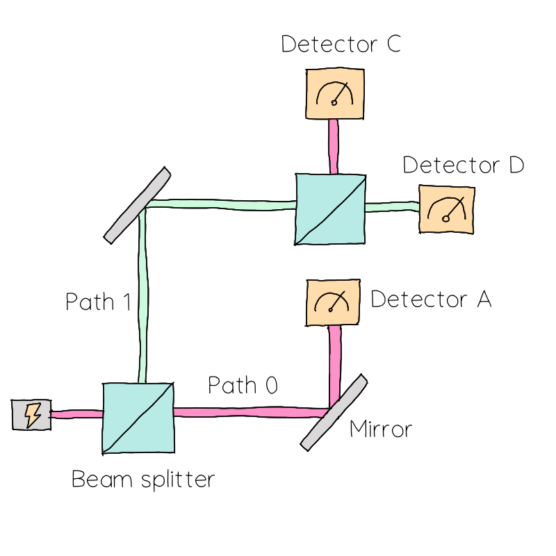

## Challenge statement

In the depths of the Femto Forest, the Mach-Zender Cabin offers shelter to hikers who are wary and lost. The electric wiring of the cabin, however, has been tampered with by mischievous travellers who just wanted to have some fun and practice their experimental quantum skills.

Inside the cabin, there is a single light switch that may turn on the lights in the washroom, the bedroom, or the lounge at random. Internally, the circuit is actually a Mach-Zender interferometer with two beam splitters and detectors placed in each arm. Each detector triggers a particular light bulb.

As you enter the Mach-Zender Cabin, you realize that there's a dial which lets you control the reflection coefficient of the Beam splitters. *"At the very least I'll be able to control the probability of turning each light on"* you mutter to yourself. You take out your laptop to do the calculation in PennyLane.

The Mach-Zender interferometer is a prototypical experimental sandbox in quantum optics. With it, we can illustrate and observe a plethora of quantum phenomena using photons. 

In this challenge, we want to simulate the following interferometer that emulates the Cabin's internal circuitry.


<p align="center">

</p>


A photon in the interferometer can take two paths, labelled $0$ and $1.$ The state of a photon that goes through path $0$ (pink path) is denoted by $\vert 0 \rangle;$ if the photon goes through path $1$ (green path), its state is $\vert 1 \rangle$.   

The beam splitters are modelled via the unitary matrix

$$ B(R) = \begin{pmatrix} R & T \\ T & -R \end{pmatrix}, $$

(in the computational basis) where $R$ and $T$ are the reflection and transmission coefficients, related via $T=\sqrt{1-R^2}$. Their output is, in general, a photon in a superposition of $\vert 0 \rangle$ and $\vert 1 \rangle$. 

As we can see in the figure, a detector $A$, the lounge light bulb, is placed in path $0$ before the second beam splitter. If this detector measures a photon, it will absorb it, so it will not travel through the rest of the interferometer and no other lights will turn on in the cabin.

After the second beam splitter, detectors $C$ and $D$, which trigger the bedroom and washroom respectively, are placed as shown. These lights will only turn on if the photon went through path $1$ initially (i.e., detector $A$ doesn't detect a photon).

In this challenge, you are asked to build a circuit that models this interferometer using mid-circuit measurements. Such a circuit will calculate the following probabilities:

- $p_{AC}:$ The probability that either $A$ or $C$ detect a photon; that is, the probability that either the lounge or bedroom lights are lit.
- $p_{D}:$ The probability that $D$ detects a photon, so that the bathroom light turns on.

Assume that both beam splitters have the same reflection coefficients.

*Note:* Although the mirrors introduce a relative phase of $-1$, they can be ignored in this challenge, since each mirror introduces this phase in either path.

## Challenge Code

In the challenge template, you must complete the `beam_splitter` helper function which, given the reflection coefficient `r` (`float`) of the beam splitters, returns the matrix for the beam splitter (`np.array`) as defined above.

Then, you must complete `mz_interferometer`, a QNode that depends on the reflection coefficient `r` (`float`) of the beam splitters and returns an array $[p_{AC}, p_D]$ containing the probabilities (`np.tensor`) defined above. 

### Input

As an input to this challenge, you are given the reflectivity `r` (`float`) of the beam splitters. 

### Output

The expected output is an `np.array` of shape `(2,)` containing the probabilities  $[p_{AC}, p_D]$ in this order. 

### Test cases

The following **public test cases** are available for you to check your work. There are also some **hidden test cases** which we will use to check that your solution works in full generality.

```python
test_input: 0.5
expected_ouput: [0.8125, 0.1875]

test_input: 0.577350269
expected_output: [0.777778, 0.222222]
```

If your solution matches the correct one up to a relative tolerance of $1\times 10^{-4}$, the output will be `"Success!"`. Otherwise, you will receive an `"Incorrect"` prompt.

Good luck!