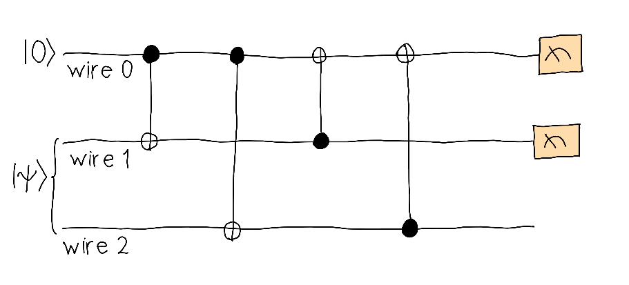

## Challenge statement

No traveller would like to leave the sandy plains of the Dipole Desert without buying a souvenir! The Quantum Trinket Market offers all kinds of quantum-based knickknacks for you to remember your travels by, in case all the sand you'll keep sweeping at home isn't enough. 

A special kind of trinket, known as the Quirklet, is very popular with travellers. It exhibits all kinds of macroscopic superpositions, which leaves people in awe. Quirklets are expensive though. And since they work based on an unknown quantum state, no one can make knockoffs.

Unfortunately, some dishonest merchants who don't know how to make the Quirklets have figured out a way to copy them, even though a well-known result in quantum theory is that we cannot clone quantum states. But these merchants are willing to clone them imperfectly! So be aware that if you see a cheap Quirklet, it probably won't work quite right.

In this challenge, we implement an imperfect *cloning machine* that imperfectly clones the input quantum state, taken to be $\vert 0 \rangle$ (although it can be any pure state!). The cloning machine is implemented via the three-qubit circuit shown below.

<p align="center">

</p>

The input state on wires $1$ and $2$ is a superposition

$$ 
\vert \psi \rangle = c_0\vert \phi_0 \rangle + c_1\vert \phi_1 \rangle
$$

where $c_0$ and $c_1$ are real numbers and 

$$
\vert\phi_0\rangle = \frac{1}{\sqrt{2}}(\vert 00\rangle + \vert 11 \rangle),
$$

$$
\vert\phi_1\rangle = \frac{1}{\sqrt{2}}(\vert 00\rangle + \vert 01 \rangle).
$$

The normalization of $\vert \psi \rangle$ implies we must have $ c_0^2 + c_1^2 + c_0 c_1 = 1$. 

It turns out that we can adjust $c_0$ and $c_1$ so that the output states in wires $0$ and $1$ are close to the input state $\vert 0 \rangle$, as measured by the fidelity. The best cloning happens when $c_0 = c_1 = \frac{1}{\sqrt{3}}$. 

Your goal in this challenge is to calculate the fidelities between the output states in wires $0$ and $1$ and the input state $\vert 0 \rangle$ as a function of the coefficients $c_0$ and $c_1$. **You may only use RX, RY, and CNOT gates** (`qml.RX`, `qml.RY`, `qml.CNOT`).


## Challenge Code

In the code template shown, you must complete the following functions:

- The QNode `cloning_machine`, which prepares the input state $\vert 0 \rangle \vert \psi \rangle$ and implements the cloning machine defined above. Its first argument is an array `coefficients` of the form $[c_0, c_1]$ `(np.array(float))` containing the amplitudes of $\vert \psi \rangle.$ The second argument is a `wire` corresponding to the wire on which we calculate the output state. Note that this state is represented by a reduced density matrix. This QNode may only contain the `qml.RX`, `qml.RY`, and `qml.CNOT` gates. 

- `fidelity`, which takes in the `coefficients` (`(np.array(float))`) and returns an array (`np.array(float)`) $[F_0, F_1]$, where
    - $F_0$  is the fidelity between the cloning machine output on wire $0$ and the initial state $\vert 0 \rangle,$
    - $F_1$  is the fidelity between the cloning machine output on wire $1$ and the initial state $\vert 0 \rangle.$

### Input

As an input to this challenge, you are given an array (`np.array(float)`) $[c_0, c_1]$ containing the amplitudes of $\vert \psi \rangle.$ Note that these already satisfy the normalization condition $ c_0^2 + c_1^2 + c_0 c_1 = 1$.

### Output

The expected output is an array (`np.array(float)`) $[F_0, F_1]$ containing the fidelities between the output states in wires $0$ and $1$ and the initial state $\vert 0 \rangle$. 

### Test cases

The following **public test cases** are available for you to check your work. There are also some **hidden test cases** which we will use to check that your solution works in full generality.

```python
test_input: [0.5773502691896258, 0.5773502691896257]
expected_ouput: [0.83333333, 0.83333333]

test_input: [0.2, 0.8848857801796105]
expected_output: [0.60848858, 0.98]
```

If your solution matches the correct one up to an absolute tolerance of $1\times 10^{-4}$, the output will be `"Success!"`. Otherwise, you will receive an `"Incorrect"` prompt.

Good luck!