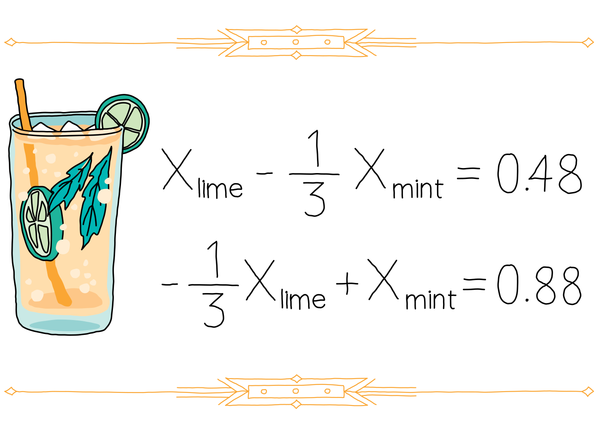

## Challenge statement

The club at the Boson Beach resort was once a fervorous gathering place filled with good times and tasty drinks. In its current form today, it has definitely seen better days... the floor creeks with every step, some lights work and others don't, and it looks like nobody has sat on one of the bar stools in months. 

You fancy a mocktail and head in. The bartender tells you that the recipe for their world-renowned ***Mojito with HHLime twist*** has gone missing; they think an employee took it with them out of spite years ago and that's the reason why nobody will come back to the resort. They tell you the origin story of the famous beverage...

"It was a cool summer evening on the QHack resort when my grandparents wrote down the ideal way to create a Mojito with lime. I can't remember how they came up with this, but they wrote these linear equations down that, when solved, would provide the perfect ratio of mint and lime... if only we could solve it! Can you please help us?"

They show you the equations:

<p align="center">

</p>

In case you couldn't read that, it says:

$$
\begin{align*}
x_{\texttt{lime}} - \frac{1}{3}x_{\texttt{mint}} &= 0.48 \\
-\frac{1}{3}x_{\texttt{lime}} + x_{\texttt{mint}} &= 0.88
\end{align*}
$$

Of course you'll help, because you have a quantum computer that can run the Harrow-Hassidim-Lloyd (HHL) algorithm!

Being a curious person, the bartender asks you to explain the HHL algorithm so that they can verify if you'll properly solve the system of equations. 

"There's no time. But, here are some great papers that you can read," you exclaim.

1. [A Step-by-Step HHL Algorithm Walkthrough to Enhance Understanding of Critical Quantum Computing Concepts](https://arxiv.org/pdf/2108.09004.pdf)
2. [Quantum algorithm for linear systems of equations](https://arxiv.org/pdf/0811.3171.pdf)

In this coding challenge, you must implement the Harrow-Hassidim-Lloyd (HHL) algorithm that can solve the mystery of the Mojito with HHLime twist. We encourage you to consult the references provided above if you are not familiar with the HHL algorithm, but we will provide a brief summary here:

Consider a system of linear equations written in matrix-vector form:

$$
A \vert x \rangle = \vert b \rangle, \text{ or} \\
\vert x \rangle = A^{-1} \vert b \rangle
$$

where $A$ is a hermitian matrix with known entries, $\vert x \rangle = (x_0, \cdots, x_{n-1}, x_n)^T$ is a vector whose entries are unknown, and $\vert b \rangle$ is a vector whose entries are known (the RHS of the linear equations). One can solve for $\vert x \rangle$ by doing the following on a quantum circuit:

1. Encode $\vert b \rangle$ into a quantum circuit (we will call this register the "b" register)
2. Perform [quantum phase estimation (QPE)](https://docs.pennylane.ai/en/stable/code/api/pennylane.QuantumPhaseEstimation.html) with the unitary $U = \exp{iA}$ (the extra register needed to perform QPE is called the "QPE" register)
3. Perform a series of controlled-$R_y$ operations whose control register is the QPE register and whose target register is *another* register that we'll call the "ancillary" register (this register just has one qubit).
4. Postselect the $\vert 1 \rangle$ state from the ancilarry register.
5. Perform the same QPE as in step 2 but use its adjoint.
6. Look at the state of the "b" register — it should be $\vert x \rangle$.

Again, please consult these references if you aren't familiar with the algorithm:

1. [A Step-by-Step HHL Algorithm Walkthrough to Enhance Understanding of Critical Quantum Computing Concepts](https://arxiv.org/pdf/2108.09004.pdf)
2. [Quantum algorithm for linear systems of equations](https://arxiv.org/pdf/0811.3171.pdf)

## Challenge code

In the code below you must complete the following functions and classes:

1. `mint_to_lime`: this function contains the HHL algorithm that you will code and returns the vector $\vec{x}$.
2. `HHL`: this is a QNode within `mint_to_lime` that implements the HHL algorithm given a $2 \times 2$ matrix $A$ and length-2 vector $\vec{b}$.

There is space at the start of the code below for you to add any other functions that you want to define.

### Input

As an input to this problem, you are given $A$ — a $2 \times 2$ hermitian matrix with real-valued entries — and $\vec{b}$ — a length-$2$ normalized vector with real-valued entries (the RHS of the system of linear equations). 

### Output

Your code must output $\vec{x}$, which is the (approximate) solution to the equation $\vec{x} = A^{-1}\vec{b}$.

### Test cases

The following **public test cases** are available to you. Note that there are additional **hidden test cases** that we use to verify that your code is valid in full generality.

```python
test_input: [[[1, -0.333333], [-0.333333, 1]], [0.48063554, 0.87692045]]
sample_output:, [0.6123100731658992, 0.7906177169127275], 
test_input: [[[0.456, -0.123], [-0.123, 0.123]], [0.96549299, 0.26042903]]
sample_output:, [0.5090526763759141, 0.8607353673888718],
```

If your calculated solution `x` matches the correct one within the `1e-3` relative error tolerance, the output will be `"Success!"`. Otherwise, you will receive an `"Incorrect"` prompt.

Good luck!