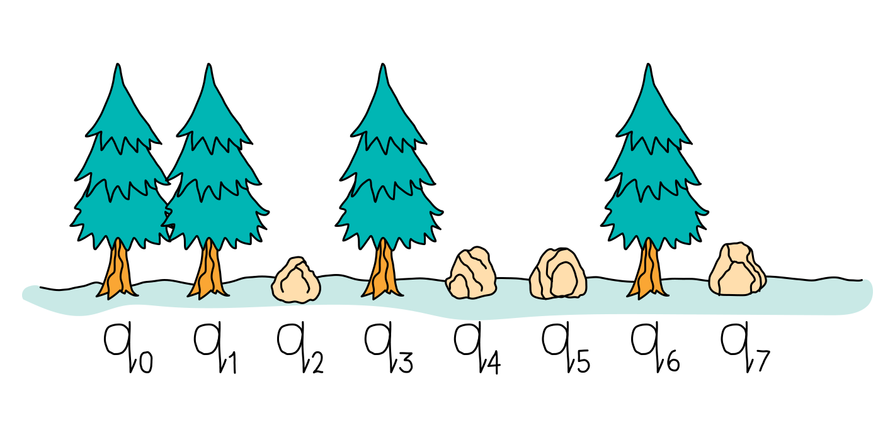
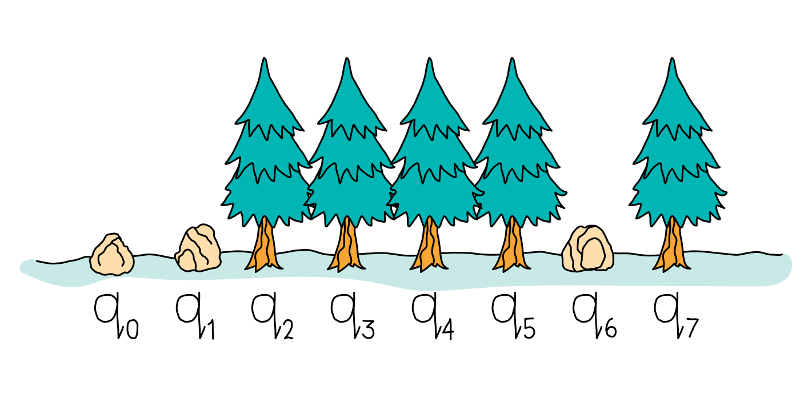
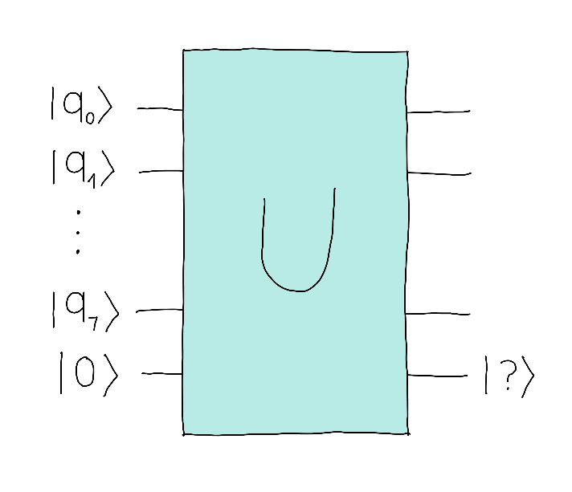

## Challenge statement 

We are located in the Femto forest retreat, an ideal place to be in contact with nature. Normally we organize excursions in the surroundings, but on rainy days we play games in the warmth of the cottage. One of these games is very simple, it consists of counting forests that we observe through the window. 

We define a forest as a set of trees that are consecutive without any obstacle between them. In the example below, we can find 3 forests separated by stones.

<center>

</center>

In this second example, we can only find 2 forests.

<center>

</center>

Our goal will be to use a quantum computer to count the forests!

We represent the positions that have a tree with $|1\rangle$ and the positions that do not with $|0\rangle$. Thus, the first image would correspond to the state $|\phi\rangle = |11010010\rangle$ and the second image corresponds to $|\phi\rangle =|00111101\rangle$.
We always have 8 qubits representing the landscape.

In this challenge, your goal will be to create an operator $U$ that outputs the parity of the number of forests in an auxiliary register. The output will be  $\vert 0 \rangle$ if it's even and $\vert 1 \rangle$ if it's odd. 

<center>

</center>

### Challenge code

Complete the quantum function `U`  so that the output behaves as described in the statement.
The function will not return anything, it will simply define the necessary gates. You must return the parity of the forests in the last qubit 
Note that the total number of qubits in the circuit, including the auxiliary qubit, is 9.


### Input

List of 1s and 0s (`list`(`int`)) representing the forest configuration.

### Output

1 or 0 (`int`) corresponding to the parity of the number of forests in the input.

### Test cases

The following public test cases are available for you to check your work. There are also some hidden test cases, which we will use to check that your solution works in full generality.

```
test_input: [1,0,1,1,0,1,1,1]
expected_output: 1

test_input: [0,0,0,0,0,1,0,1]
expected_output: 0
```
