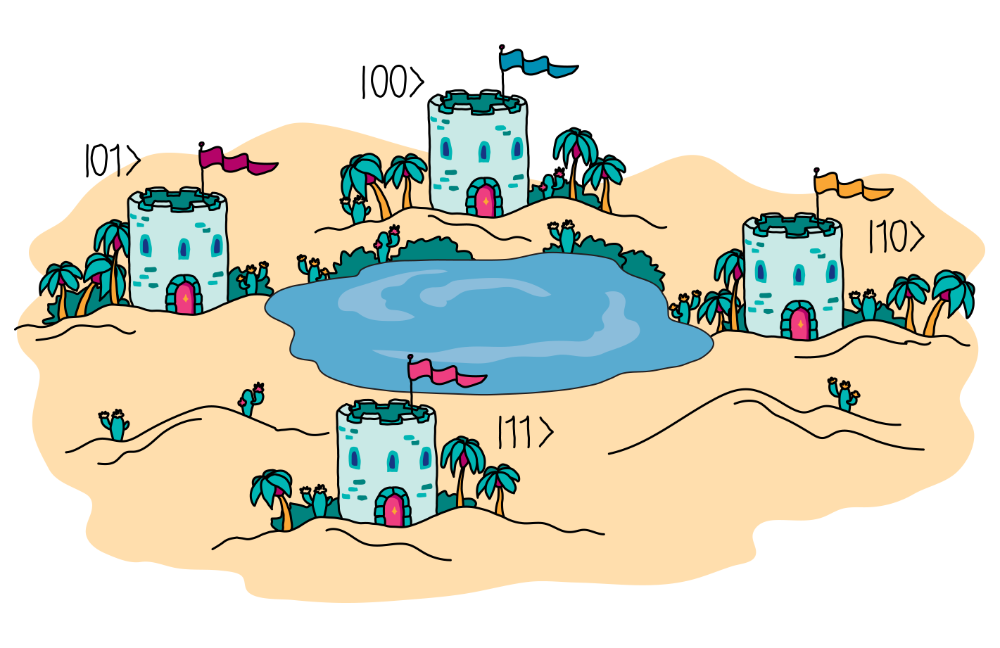

## Challenge statement

You are in the Oracle Oasis in the depths of the Dipole Desert, a place that transmits peace and calm in the middle of this arid landscape.  Paying attention to your surroundings, you can see the ruins of different villages that stood upon this oasis centuries ago. 

These ruins are from the kingdom of Bitland and the four sites around the oasis are the remains of the famous cities of North-bit, East-bit, South-bit and West-bit.  Because the oasis was in the middle, only the neighbouring villages were connected, as shown in the figure. 

North-bit, West-bit, East-bit and South-bit will be represented with the bits `00`, `01`, `10`, and `11` respectively.

In the Kingdom, there were four magical states, $|0\rangle$, $-|0\rangle$, $|1\rangle$, and $-|1\rangle$,  which were distributed among the four villages (you don't which village has which magical state).

It is not known exactly why these villages disappeared. But legend has it that it was because two neighbouring villages had the two positive magic states ($|0\rangle$ and $|1\rangle).$ I can't go into details as they won't let tourists comment on why it would be so dangerous. I'll just say that it would make those two neighbours too powerful.

Your challenge will be to check if the kingdom disappeared for that reason or not.  So, you decide to go to the all-knowing Oracle to find out. You can query the Oracle to see what magical state each village owns as follows:

The Oracle takes as input the index of the village you want to ask about and will output the associated magical state. 
In this example, we see that the village labelled by `10` (East-bit) had the magic state $-|1\rangle$.

You may ask the oracle a single question (and a single shot) and that should be enough to discover the truth. To check your solution, we will make a measurement on the third qubit (`wires = 2`). It should be `1` (i.e., $|\langle 1 | x \rangle| = 1$) if the Kingdom legend is true and `0` otherwise. 

In case it is useful to you, the Oracle is built in the following way,

where the control values can be anything as long as the oracle behaves in the way described above.

As you see, the Oracle is composed of a controlled-$X$ (`qml.PauliX` gate) and controlled $-I$ (`qml.GlobalPhase(np.pi)`) gate. The controlled-$X$ gate is responsible for establishing whether the output state is $|0\rangle$ or $|1\rangle$ depending on whether it is applied or not, and the controlled $-I$ gate will choose the sign.

## Challenge code

Complete the `circuit` function using the Oracle and other gates around to find out whether neighbouring villages possessed two positive magic states. You can query the oracle using `Oracle(wires = [0, 1, 2])`. **Don't forget that you must obtain an answer using a single shot.**

### Inputs, Outputs, and Testing

There are no inputs and outputs in this challenge. Your solution will be tested against all valid oracles using a single shot.

