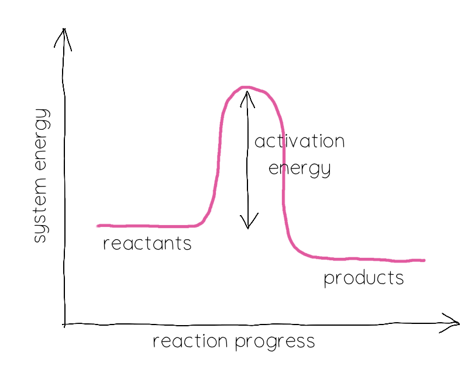

## Challenge statement

Off the cruise ship you go, and onto the once lovely QHack Beach! The QHack Beach was host to one of the world's greatest marine ecosystems. Crisp blue water, exotic fish, sharks, a coral reef — you name it! And the beach... oh... the beach. Perfect silky sand, shade provided by palm trees... A traveller's paradise 😎

Due to global warming, though, the beach is way too hot for any living organism to enjoy, yourself included! But... with the power of quantum and with a large supply of some chemicals on the ship, we can reduce the temperature of the QHack lagoon, revitalize the marine life, and catch some rays ☀️ in peace.

There's a ton of Lithium and Hydrogen on the ship, and based on some rough calculations using the Hartree-Fock method, we know that creating lithium hydride from $\text{H}_2$ and $\text{Li}_2$ is endothermic — it absorbs heat. This is how we can take some heat off of the beach!

Lithium hydride, $\text{Li}\text{H}$, can be formed via a very simple chemical reaction:

$$
\text{H}_2 + \text{Li}_2 \rightarrow 2\text{Li}\text{H}.
$$

You're going to dissect this reaction to the bone!

Chemical reactions are kind of magical; molecules are broken into pieces and get stuck back together differently. The intermediate stages of a chemical reaction are an interesting field of research, and here we're going to crudely simulate what happens.

Starting with $\text{H}_2$ and $\text{Li}_2$, $\text{Li}\text{H}$ is formed by both $\text{H}$ atoms dissociating in $\text{H}_2$, both $\text{Li}$ atoms dissociating in $\text{Li}_2$, and partnering up with the other — a lone $\text{H}$ atom finds a lone $\text{Li}$ atom and they bond! By looking at the molecular energy of the reactants — $\text{H}_2$ and $\text{Li}_2$ — and products — $\text{Li}\text{H}$ — as their interatomic distances change, we can get an estimate for the amount of energy that is required to break the bonds and form new ones.

**Your challenge is to map out the energetics of the reaction by calculating the following:**

1. $E_{\text{react.}}$: what's the molecular energy of the reactants?
2. $E_{\text{dissoc.}}$: how much energy is required to break the bonds of the reactants?
3. $E_{\text{prod.}}$: what the energy of the product?

Your job is to fill in the blanks! You must estimate all energies with the [Hartree Fock method](https://en.wikipedia.org/wiki/Hartree%E2%80%93Fock_method). In PennyLane, this amounts to employing the [`hf_energy`](https://docs.pennylane.ai/en/stable/code/api/pennylane.qchem.hf_energy.html?) function.

For the reactants and products, their energies are the minimum of the Hartree Fock energy, $E_0$, calculated at various provided bond lengths. The activation energy, $E_a$, can be loosely estimated as 

$$
E_{a} = E_{\text{react.}} + E_{\text{dissoc.}}
$$

where $E_{\text{react.}} = E_{0, \text{H}_2} + E_{0, \text{Li}_2}$ and $E_{\text{dissoc.}} = E_{\text{dissoc.}, \text{H}_2} + E_{\text{dissoc.}, \text{Li}_2}$ is the dissociation energy (the amount of energy required to break the diatomic bond). $E_{\text{dissoc.}, \text{X}}$ should be calculated as the Hartree Fock energy at infinite bond length, but we'll estimate it as the Hartree Fock energy at the biggest bond length for which we calculated it: $E_{\text{dissoc.}, \text{X}} \approx |E0 - E(r_{\text{max}})|$.

## Challenge code

In the code below you must complete the following functions:

1. `potential_energy_surface`: calculates the molecular energy over various bond lengths (AKA the potential energy surface) using the Hartree Fock method.
2. `reaction`: calculates the energy of the reactants, the activation energy, and the energy of the products in that order.

There is also a function called `ground_energy` that finds the minimum energy of a molecule given its potential energy surface. You do not need to complete this function, it's there as a helper!

### Input

There are no inputs to this problem; there is only one correct answer!

### Output

Your code will output the (chemically balanced) energies of the reactants and products and the activation energy.

### Test cases

There are no test cases for this problem; there is only one correct answer!

If your solution matches the correct one within the `1e-3` relative error tolerance, the output will be `"Success!"`. Otherwise, you will receive an `"Incorrect"` prompt.

Good luck!