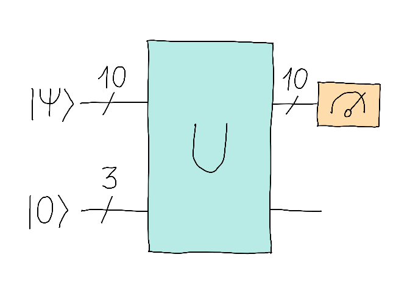

## Challenge statement

In Boson Beach's Partition Port, three shipping companies that transport goods to Qutropolis. Every time a new cargo arrives at the port, it is very important that the goods be divided into 3 equal parts for each of these companies. We don't want any ship doing extra work!

Having been around Qutopia for a while now, you've realized that people use quantum devices for many of their daily tasks, so it strikes you as strange that they're still doing the splitting of goods manually. Even worse, the slow pace at which they're doing this is delaying the passenger ships bound for Qutropolis. Maybe it's time to help out?

Your goal will be to create an operator `U` that is able to perform the correct distribution of goods.
To do this, `U` will receive a quantum cargo, described by an arbitrary 10-qubit state $|\psi\rangle$. `U` will work in such a way that, when measuring the output in the computational basis, the output basis state will contain a number of 1s that is a multiple of three.  This will facilitate the fair splitting of parcels! 

For this purpose, you will have three auxiliary qubits as shown in the image below.

## Challenge code

Your goal will be to complete the quantum function `U`, which is able to perform the correct partitioning. This function should not return any value, it simply contains the gates that are needed. We will take care of generating $|\psi\rangle$ and making sure that the distribution is fair!

In this challenge, you are not allowed to use the `qml.QubitUnitary` gate. Good luck!

## Test cases

We will not have test cases. To test the solution we will generate 1000 initial states randomly and check that the requested condition is fulfilled.