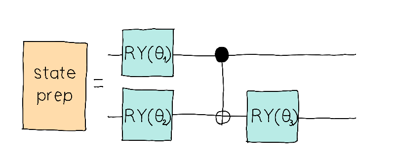
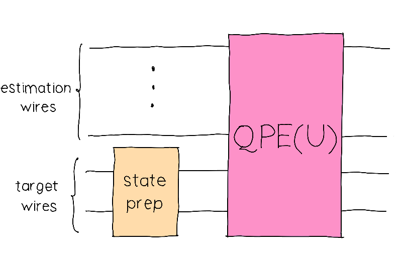

## Challenge statement

In Tensor Tundra's Quantum Platform of Eigentracks, the train tracks exist in a superposition of eigenstates of a 2-qubit Hamiltonian. The eigenstates, or Eigentracks, are paths to Boson Beach, Femto Forest, Dipole Desert, Qutropolis. 

To make sure that the passengers are taken to the correct location, the train technicians must prepare an Eigentrack as precisely as possible. We don't want to recohere the passengers after all! They can't always do it perfectly, and passengers will need some time to decohere their wave function sometimes finding themselves in a different location than they intended to. 

The Quantum Phase Estimation (QPE) algorithm is one of the most coveted applications of quantum computing. It's not just an important piece of more advanced algorithms—by itself, it can help us find the ground energy of a Hamiltonian. Its precision, however, depends on our ability to prepare a state that is close to the ground state. Let's study this more in-depth in this coding challenge.

You are given a fixed two-qubit Hamiltonian $H$, represented by the following Hermitian matrix:

$$
H = \begin{pmatrix}
0.39488016 &  0.04722628 & -0.17943126 & -0.03673282\\
0.04722628 & 0.37758558 & 0.12997088 & 0.17848188\\
-0.17943126 &  0.12997088 & 0.53582574 & 0.01115543\\
-0.03673282 & 0.17848188 & 0.01115543 & 0.29170851
\end{pmatrix}.
$$

It turns out that we can approximately prepare the eigenstates of this Hamiltonian by using the `state_prep` circuit below, which depends on three parameters $\theta_1$, $\theta_2$, and $\theta_3$. 

<p align="center">

</p>

By feeding the output $\vert\psi(\theta_1, \theta_2, \theta_3)\rangle$ of this circuit into the target wires of the QPE routine, and using 

$$ U = \exp(2\pi i H)$$

as the QPE unitary, as shown below

<p align="center">

</p>

we can estimate the eigenvalue associated with the prepared state as well as the uncertainty in this estimation. **We will use a set of 6 estimation wires**, denoted by $E$. 

To estimate the eigenvalue, we use the mean

$$
\mu = \sum_{i \ \in \ E}p_i\phi_i
$$

where $\phi_i$ is the phase obtained by the QPE algorithm and $p_i$ is the probability of measuring such phase.

For the uncertainty, we use the standard deviation

$$
\sigma = \sqrt{\sum_{i \ \in \ E}p_i(\phi_i-\mu)^2}.
$$


Your objective in this challenge is to calculate both $\mu$ and $\sigma$ as estimated by the QPE algorithm given an initial state $\vert \psi(\theta_1, \theta_2, \theta_3)\rangle$ and the unitary $U = \exp(2\pi i H)$. **The eigenvalues of the Hamiltonian above are guaranteed to be in the interval** $\mathbf{[0,1]}$. 

You can use the techniques here to calculate the probability that a certain preparation will make you end up in the wrong station!

## Challenge Code

In the challenge template, you must define the matrix `U` so that 

$$ U = \exp(2\pi i H).$$

The Hamiltonian $H$ is given to you in the global variable `H`(`np.array(float)`).

**You must complete the following functions.**

- `state_prep`: A subcircuit acting on `wires` (`list`) which prepares the initial estimated eigenstate $\vert \psi(\theta_1, \theta_2, \theta_3) \rangle$ that is fed into the QPE routine. The parameters $\theta_1,$ $\theta_2,$ and $\theta_3$ are encoded in the `params` array $[\theta_1, \theta_2, \theta_3]$ (`np.array(float)`). Since it is a subcircuit, it must not return anything.
- `qpe_circuit`: A QNode which feeds the state $\vert \psi \rangle$ into the QPE routine for the unitary $U$. This circuit depends on the `params` array (`np.array(float)`) $[\theta_1, \theta_2, \theta_3]$ in order to prepare $\vert \psi \rangle$ using the subcircuit `state_prep`. It returns the computational basis measurement probabilities on the estimation wires. 
- `compute_statistics`: This function must calculate the mean and standard deviation for the phase as calculated by `qpe_circuit`. This circuit depends on the `params` array (`np.array(float)`) $[\theta_1, \theta_2, \theta_3]$ and returns two `float` values corresponding to $\mu$ and $\sigma$, in this order.

### Input

As an input to this challenge, you are given an array `np.array(float)` of the form $[\theta_1, \theta_2, \theta_3]$ containing the parameters of the state preparation circuit.

### Output

The expected outputs are the mean $\mu$ (`float`) and the standard deviation (`float`).

### Test cases

The following **public test cases** are available for you to check your work. There are also some **hidden test cases** which we will use to check that your solution works in full generality.

```python
test_input: [1.35889209, -0.6219561, -1.31577162]
expected_ouput: 0.121662, 0.120539

test_input: [4.40084815, -0.77288063,  0.6425846]
expected_output: 0.303264, 0.043692
```

If your solution matches the correct one up to an absolute tolerance of $1\times 10^{-4}$, the output will be `"Success!"`. Otherwise, you will receive an `"Incorrect"` prompt.

Good luck!