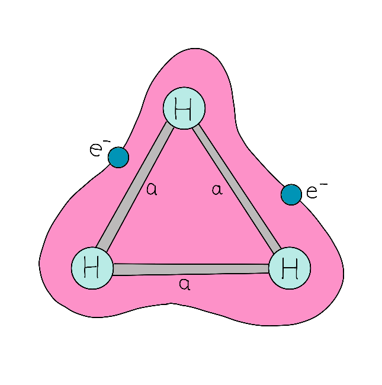

## Challenge statement

Only the most daring adventurers are rewarded with a luxurious stay at the Triple H Hotel, so if you made it all the way here, just take the compliment! The hotel offers all kinds of luxurious services: the rooms have heated floors, the steam rooms are a great way to get your body temperature back to normal, and the warm apple cider offered at the bar is to die for.

But how does the hotel generate so much heat if it's in such a cold environment? The hotel was built over extremely cold reservoirs of $H_3^{+}$ gas, even colder than the unforgiving outside environment. The hotel leverages this difference in temperature to build an engine that steals the little heat present outside to warm up the hotel and power all of its services.

In such cold conditions, these $H_3^{+}$ ions are almost in their ground state. Physicists are known to have sneaked into the reservoirs in the basement just to measure the ground energy of these molecules and see that they match their most precise calculations. This way, they don't have to cool the $H_3$ molecules in their lab and get to enjoy some apple cider!

The geometry of an ionized $H_3^{+}$ molecule can be modelled as an equilateral triangle with bond length $a$, as shown in the figure.

<p align="center">

</p>

In this challenge, we aim to find the ground state of the $H_3^{+}$ as a function of the bond length. You will build the molecular Hamiltonian using PennyLane's quantum chemistry functionalities and then find its minimum eigenvalue. To achieve this, you should use the Variational Quantum Eigensolver (VQE) to get as close as possible to the true ground state.

See if you can sneak into the reservoirs and check your results!

## Challenge Code

In the challenge template, **you must complete** the `h3_ground_energy` function, which calculates the ground energy (`float` or float-like) of the $H_3^+$ ion as a function of the `bond_length` (`float`). 

### Input

As an input to this challenge, you are given the bond length `bond_length` (`float`) of the $H_3^+$ ion modelled as an equilateral triangle. 

### Output

The expected output is a `float` (or float-like) equal to the ground energy of the $H_3^{+}$ ion. 

### Test cases

The following **public test cases** are available for you to check your work. There are also some **hidden test cases** which we will use to check that your solution works in full generality.

```python
test_input: 1.5
expected_ouput: -1.232574

test_input: 0.8
expected_output: -0.3770325
```

If your solution matches the correct one up to an absolute tolerance of $1\times 10^{-4}$, the output will be `"Success!"`. Otherwise, you will receive an `"Incorrect"` prompt.

Good luck!