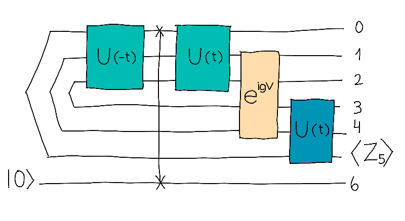
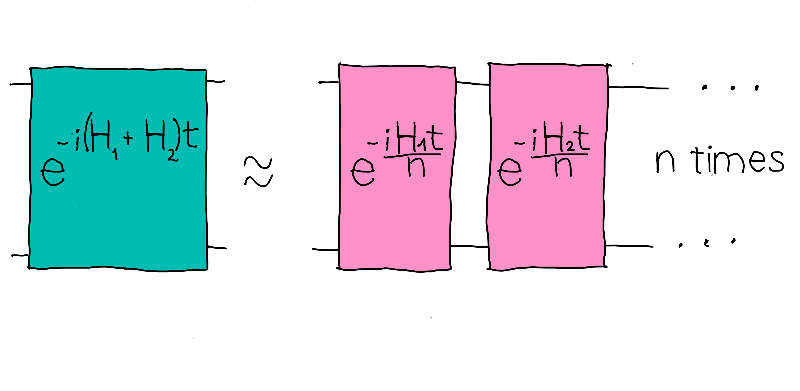

Note from the author: Do you remember about a year ago when it was announced that [a wormhole was built inside a quantum computer](https://www.quantamagazine.org/physicists-create-a-wormhole-using-a-quantum-computer-20221130/)? Well, that was just the news being the news. Even trustworthy sources made these overblown claims! What they actually did was to program a quantum algorithm that exhibits properties similar to a simplified mathematical definition of a wormhole. It's still cool though, and we'll learn about it in this challenge. 


## Challenge statement

After centuries of studying the wormholes that sandworms build to teleport around the Dipole Desert, engineers managed to build a man-made version of it in the sky, through which airplanes can quickly travel to Qutropolis. The Wormhole Airdrome was thus founded, and to nobody's surprise, it's one of the main attractions of Qutopia. After all, where else in the world do you get to travel by wormhole? So have your suitcase and passport at the ready... solving this challenge will get you a step closer to Qutropolis!

So how was it possible to reverse-engineer these wormholes? Wormholes are gravitational objects, where you enter into a black hole and exit in another part of the universe (did you watch Interstellar?). There is a technique in physics, known as the [gauge-gravity correspondence](https://en.wikipedia.org/wiki/AdS/CFT_correspondence) that allows us to translate gravitational objects, such as black holes and wormholes, into quantum objects, such as quantum circuits. Qutopia uses quantum circuits for every kind of technology, so it's not surprising that they were able to pull this off!

In 2023, a quantum circuit that corresponds to the physics of a wormhole was [implemented on a real-life quantum device](https://www.nature.com/articles/s41586-022-05424-3). It gave everyone in the worldwide quantum community something to talk about for a few weeks, and it was the eureka moment for Qutopia Engineers. In this challenge, we simulate a simplified version of this circuit, as proposed by Shapoval et. al in [this interesting article](https://arxiv.org/abs/2205.14081). 

The circuit that we would like to simulate is shown in the figure below. 

<p align="center">

</p>

The pairs of qubits that are joined are maximally entangled pairs, described via the Bell state $\frac{1}{\sqrt{2}}(\vert 00\rangle + \vert 11 \rangle)$. 

The unitary $U(t) = \exp(-i H t)$ is the evolution operator associated with the Hamiltonian 

$$ 
H = -\frac{\pi}{4}\left(\sum_{j=0}^{1}Z_{j}\otimes Z_{j+1}+\sum_{j=0}^2 X_{j}\right).
$$

The operator shown $e^{igV}$ shown in the figure describes the action of a wormhole, so we call it the **Wormhole operator**. It has been created for you as a $g$-dependent gate by the name `Wormhole`. You don't need to know the details about it, but the explicit operator is defined as a class in the code, so feel free to look at it!

Our objective is to write the circuit above using the gates that are native to a superconducting device. Such gates are $\sqrt{X}$, $\sqrt{Y}$, and $fSim$, defined as follows 

$$
\sqrt{X} = RX(\pi/2)
$$

$$
\sqrt{Y} = RY(\pi/2)
$$

$$
fSim(\theta,\phi) = \begin{pmatrix} 1 & 0 & 0 & 0 \\
0 & \cos{\theta} & -i\sin{\theta} & 0 \\ 0 & -i\sin{\theta} & \cos{\theta} & 0 \\ 0 & 0 & 0 & e^{-i\phi}\end{pmatrix}.
$$

Our goal is to write all the gates that come before and after the `Wormhole` gate, including the gates needed to create the Bell pairs, using *only these superconducting-native gates*. They are defined for you within the challenge as `SQRTX`, `SQRTY`, and `fSim` respectively (no need to add `qml.` before the gate!). 

For the evolution operator $U(t)$, **you are required to simulate the time evolution for** $t=3$ **using Trotterization of order** $n=3$ as shown in the figure below.

<p align="center">

</p>

Don't hesitate to look at the [original article](https://arxiv.org/abs/2205.14081). The circuit is there, but you must compile it for a superconducting circuit with the allowed gates and for arbitrary values of $g$. 

For specific values of $g$, the circuit implements the teleportation of quantum states, which is [thought to be related](https://en.wikipedia.org/wiki/ER_%3D_EPR) to wormholes connecting distant regions of spacetime. The circuit can be implemented using only Clifford gates! Algorithms of this type are known as *Wormhole Inspired Teleportation* protocols.

## Challenge Code

In the challenge template, you must complete the following function.

- `wormhole_teleportation` Given $g$ (`float`) this QNode implements the Wormhole Inspired Teleportation protocol presented above using only the $\sqrt{X}$, $\sqrt{Y}$, and $fSim$ gates we have defined for you. You are only allowed to use the `Wormhole` gate once. This function should return the expectation value (`np.tensor(float)`) of the Pauli $Z$ operator in the sixth wire, as shown in the figure.

You are also given some space to write some helper functions. For example, you may find it useful to write better-suited subcircuits in terms of $\sqrt{X}$, $\sqrt{Y}$, and $fSim.$

### Input

As an input to this challenge, you are given the parameter $g$ (`float`) of the Wormhole gate. 

### Output

The expected output is a `float` representing the expectation value of the Pauli $Z$ operator in the sixth wire.

### Test cases

The following **public test cases** are available for you to check your work. There are also some **hidden test cases** which we will use to check that your solution works in full generality.

```python
test_input: 1.25663706
expected_ouput: -0.9045085

test_input: 1.5707963
expected_output: -1.000
```

If your solution matches the correct one up to a relative tolerance of $1\times 10^{-4}$, the output will be `"Success!"`. Otherwise, you will receive an `"Incorrect"` prompt.

Good luck!